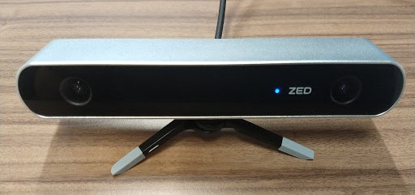

# Visual Odometry with the ZED Stereo Camera
This tutorial briefly describes the ZED Stereo Camera and the concept of Visual
Odometry. It also provides a step-by-step guide for installing all required
dependencies to get the camera and visual odometry up and running. Lastly, it
offers a glimpse of 3D Mapping using the RTAB-Map visual SLAM algorithm.


Contents
--------
- [STEREOLABS ZED Stereo Camera](#1-stereolabs-visual-odometry)
- [Visual Odometry and SLAM](#2-visual-odometry-and-slam)
- [Installation](#3-installation)
- [Runnning](#4-running)
- [Recording and Playback](#5-recording-and-playback)

## 1. STEREOLABS ZED Stereo Camera

The ZED Stereo Camera developed by [STEREOLABS](https://www.stereolabs.com/) is
a camera system based on the concept of human stereovision. In addition to
viewing RGB, stereovision also allows the perception of depth. Advanced computer
vision and geometric techniques can use depth perception to accurately estimate
the 6DoF pose (x,y,z,roll,pitch,yaw) of the camera and therefore also the pose
of the system it is mounted on. At the same time, it provides high quality 3D
point clouds, which can be used to build 3D metric maps of the environment.

The camera can generate VGA (100Hz) to 2K (15Hz) stereo image streams. The 12cm
baseline (distance between left and right camera) results in a 0.5-20m range of
depth perception, about four times higher than the widespread Kinect Depth
sensors. Furthermore, one of the most striking advantages of this stereo camera
technology is that it can also be used outdoors, where IR interference from
sunlight renders structured-light-type sensors like the Kinect inoperable. As a
result, this system is ideal for robots or machines that operate indoors,
outdoors or both. It can also be used for many different applications, ranging
from pose estimation, mapping, autonomous navigation to object detection and
tracking and many more.

## 2. Visual Odometry and SLAM
Visual Odometry is the process of estimating the motion of a camera in real-time
using successive images. There are many different camera setups/configurations
that can be used for visual odometry, including monocular, stereo,
omni-directional, and RGB-D cameras. The cheapest solution of course is
monocular visual odometry. However, with this approach it is not possible to
estimate scale. This can be solved by adding a camera, which results in a stereo
camera setup.

The following approach to stereo visual odometry consists of five steps.
Firstly, the stereo image pair is rectified, which undistorts and projects the
images onto a common plane. Feature detection extracts local features from the
two images of the stereo pair. Then, Stereo Matching tries to find feature
correspondences between the two image feature sets. Since the images are
rectified, the search is done only on the same image row. Usually the search is
further restricted to a range of pixels on the same line. There is also an
extra step of feature matching, but this time between two successive frames
in time. Finally, an algorithm such as RANSAC is used for every stereo pair to
incrementally estimate the camera pose. This is done by using the features that
were tracked in the previous step and by rejecting outlier feature matches.

| Stereo Rectification | Stereo Feature Matches | Temporal Feature Matches |
|:--------------------:|:----------------------:|:------------------------:|
|  |  ||
Due to the incremental nature of this particular type of pose estimation, error
accumulation is inevitable. The longer the system operates, the bigger the error
accumulation will be. Therefore, we need to improve the visual odometry
algorithm and find a way to counteract that drift and provide a more robust pose
estimate. This can be done with loop closure detection. This technique offers a
way to store a dictionary of visual features from visited areas in a
bag-of-words approach. This dictionary is then used to detect matches between
current frame feature sets and past ones. If a match is found, a transform is
calculated and it is used to optimize the trajectory graph and to minimize the
accumulated error.

| Loop Closure Detection and Map Graph Optimization |
|:-------------------------------------------------:|
| |

Visual Odometry algorithms can be integrated into a 3D Visual SLAM system, which
makes it possible to map an environment and localize objects in that environment
at the same time. RTAB-Map is such a 3D Visual SLAM algorithm. It consists of a
graph-based SLAM approach that uses external odometry as input, such as stereo
visual odometry, and generates a trajectory graph with nodes and links
corresponding to past camera poses and transforms between them respectively.
Each node also contains a point cloud, which is used in the generation of the 3D
metric map of the environment. Since RTAB-Map stores all the information in a
highly efficient short-term and long-term memory approach, it allows for
large-scale lengthy mapping sessions. Loop closure detection also enables the
recognition of revisited areas and the refinement of its graph and subsequent
map through graph optimization.


## 3. Installation
The following instructions show you how to install all the dependencies and
packages to start with the ZED Stereo Camera and Visual Odometry

### System Specifications and Libraries:
- Dell XPS-15-9570 with Intel Core i7-8750H and NVidia GeForce GTX 1050 Ti
- Ubuntu 18.04 with latest kernel (v4.20)
- Latest stable and compatible NVidia Driver (v4.15 -> for kernel v4.20)
- Latest stable and compatible CUDA (v10)
- ZED SDK (v2.71)
- ROS Melodic Morenia
- ZED ROS Wrapper
- RTAB-Map and RTAB-Map ROS wrapper

Note: You can skip the kernel upgrade and the installation of the NVIDIA driver
and CUDA if you already have installed versions and you don’t want to upgrade
to the latest versions. However, in order to work with the ZED Stereo Camera,
you need to install a version of the ZED SDK that is compatible with your CUDA.
Search the website of STEREOLABS
[website of STEREOLABS](https://www.stereolabs.com/developers/release/archives/)
for a legacy version of the SDK.

### (Optional) Upgrade Ubuntu 18.04 Kernel
Find your kernel version by running:
```bash
$ uname -r
```
Install the Ubuntu Kernel Update Utility (UKUU) and run the tool to update your
kernel:
```bash
$ sudo add-apt-repository ppa:teejee2008/ppa
$ sudo apt update
$ sudo apt install ukuu
$ ukuu-gtk
```

After the installation has been completed, reboot the computer and run the first
command again to see if you have booted with the new kernel.

### Install the latest compatible NVidia Driver
```bash
$ sudo apt-get purge *nvidia* # remove old version
$ sudo add-apt-repository ppa:graphics-drivers
$ sudo apt update
$ sudo apt install nvidia-driver-415 # change 415 to whatever version is compatible with your graphics card
$ sudo apt-mark hold nvidia-driver-415 # block nvidia driver updates
```
After the installation has been completed, reboot the computer and check whether
the driver is active by running:
```bash
$ nvidia-smi
```

### Install CUDA 10
- Complete the [Pre-Installation Actions](https://docs.nvidia.com/cuda/cuda-installation-guide-linux/index.html#pre-installation-actions)
- [Download Cuda Toolkit 10.0](https://developer.nvidia.com/cuda-downloads?target_os=Linux&target_arch=x86_64&target_distro=Ubuntu&target_version=1804&target_type=runfilelocal)
- [Disable the nouveu drivers](https://docs.nvidia.com/cuda/cuda-installation-guide-linux/index.html#runfile-nouveau)
- Reboot and go into console mode (Ctr-alt-F1 to F6) and run the following:
```bash
$ sudo service lightdm stop
$ sudo sh /path/to/NVIDIA-Linux-<system>-<version>.run 
```
Follow the command line prompts to install CUDA, but DO NOT ALLOW THE INSTALLER TO INSTALL ANOTHER NVIDIA DRIVER.
- Reboot the system to reload the graphical interface
- Add CUDA to the environment's PATH and LD_LIBRARY_PATH by adding the following commands to your .bashrc or .zshrc
```bash
$ export PATH=$PATH:/usr/local/cuda-10.0/bin
$ export LD_LIBRARY_PATH=$LD_LIBRARY_PATH:/usr/local/cuda-10.0/lib64 # or /usr/local/cuda-10.0/lib for 32 bit systems
```

### Install the ZED SDK
With CUDA 10 installed, you can install the latest [ZED SDK](https://www.stereolabs.com/developers/release/).
```bash
$ wget https://www.stereolabs.com/developers/downloads/ZED_SDK_Ubuntu18_v2.7.1.run
$ chmod +x ZED_SDK_Ubuntu18_v2.7.1.run
$ sh ZED_SDK_Ubuntu18_v2.7.1.run
```
Follow the instructions of the installer and when finished, test the
installation by connecting the camera and by running the following command to
open the ZED Explorer:
```bash
$ /usr/local/zed/tools/ZED\ Explorer
```

### Install ROS Melodic Morenia
```bash
$ sudo sh -c 'echo "deb http://packages.ros.org/ros/ubuntu $(lsb_release -sc) main" > /etc/apt/sources.list.d/ros-latest.list'
$ sudo apt-key adv --keyserver hkp://ha.pool.sks-keyservers.net:80 --recv-key 421C365BD9FF1F717815A3895523BAEEB01FA116
$ sudo apt update
$ sudo apt install ros-melodic-desktop-full
$ sudo rosdep init
$ rosdep update
$ sudo apt install python-rosinstall python-rosinstall-generator python-wstool build-essential
```
Copy the following commands to your .bashrc or .zshrc
```bash
$ source /opt/ros/melodic/setup.bash
$ source ~/.bashrc
or
$source ~/.zshrc
```

### Initialize your catkin workspace and build the ZED ros wrapper
```bash
$ sudo apt install python-catkin-tools
$ mkdir -p ~/catkin_ws/src
$ git clone git@github.com:stereolabs/zed-ros-wrapper.git ~/catkin_ws/src/zed-ros-wrapper
$ cd ~/catkin_ws
$ rosdep install --from-paths src --ignore-src --rosdistro $ROS_DISTRO -yr
$ catkin build zed_wrapper
$ source ~/.bashrc # or ~/.zshrc
```

## 4. Running
In order to launch the ZED node that outputs Left and Right camera RGB streams,
Depth, and Odometry, simply run the following command. You should see the rviz
visualization as displayed below.
```bash
$ roslaunch zed_display_rviz display.launch
```


In order to get a taste of 3D mapping with the ZED Stereo Camera, install
rtabmap and rtabmap_ros and run the corresponding launcher. You should see the
rtabmapviz visualization as displayed below.
```bash
$ sudo apt install ros-melodic-rtabmap ros-melodic-rtabmap-ros
$ catkin build zed_rtabmap_example # contained on the zed_ros_wrapper repository
$ source ~/.bashrc # or ~/.zshrc
$ roslaunch zed_rtabmap_example zed_rtabmap.launch
```


## 5. Recording and Playback
Assuming you have already installed RTAB-Map from the previous section, in this
section you can learn how to record a session with ZED and playing it back for
experimentation with different parameters of RTAB-Map.

First of all, clone and build our repository with the required launchers as
shown below:
```bash
$ git clone git@github.com:Kapernikov/zed_visual_odometry.git
$ catkin build zed_visual_odometry
$ source ~/.bashrc # or ~/.zshrc
```

Then connect a ZED Stereo Camera on your computer and launch the recorder:
```bash
$ roslaunch zed_visual_odometry zed_rtabmap_db_recorder.launch
```
Do your session with the camera and when you are done, simply close the recorder
(ctrl+c). The database of the session you recorded will be stored in
~/.ros/output.db. You can now launch the playback node along with rtabmap by
calling the corresponding launcher as follows:
```bash
$ roslaunch zed_visual_odometry zed_rtabmap_db_playback.launch
```
If you are not satisfied with the results, play around with the parameters of
the configuration file located inside our repository
(zed_visual_odometry/config/rtabmap.ini) and rerun the playback launcher.

[](https://drive.google.com/file/d/1eXQMy56tF8tgyQ_QwtJvkZ0kxY3IkN1m/preview)

